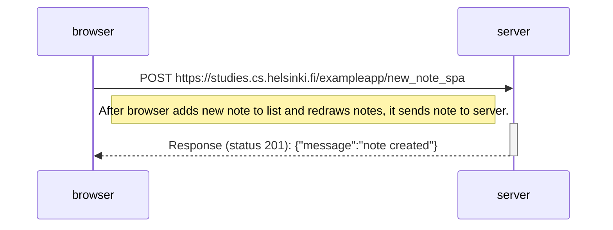

```mermaid
sequenceDiagram
    participant browser
    participant server
    
    browser->>server: POST https://studies.cs.helsinki.fi/exampleapp/new_note_spa

    Note right of browser: After browser adds new note to list and redraws notes, it sends note to server.
    
    activate server
    server-->>browser: Response (status 201): {"message":"note created"}
    deactivate server

```
